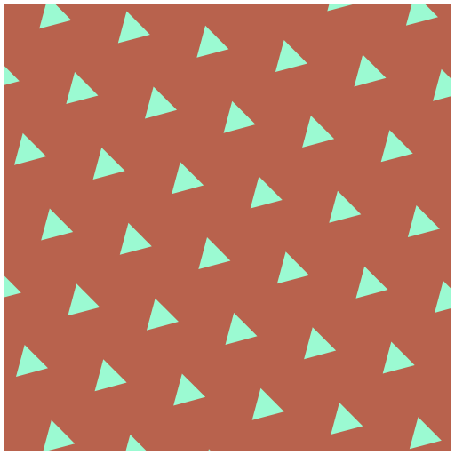

# bravais-p5js

Generative art of Bravais lattices using p5.js

# To-do

* Proper drawing of lines
* Improve color balance
* Implement centered
* Fix theta (now can be too big)
* Fix radius (can still get weird, maybe fixed with theta)
* Add variations in lines, points, etc. make the thing more interesting